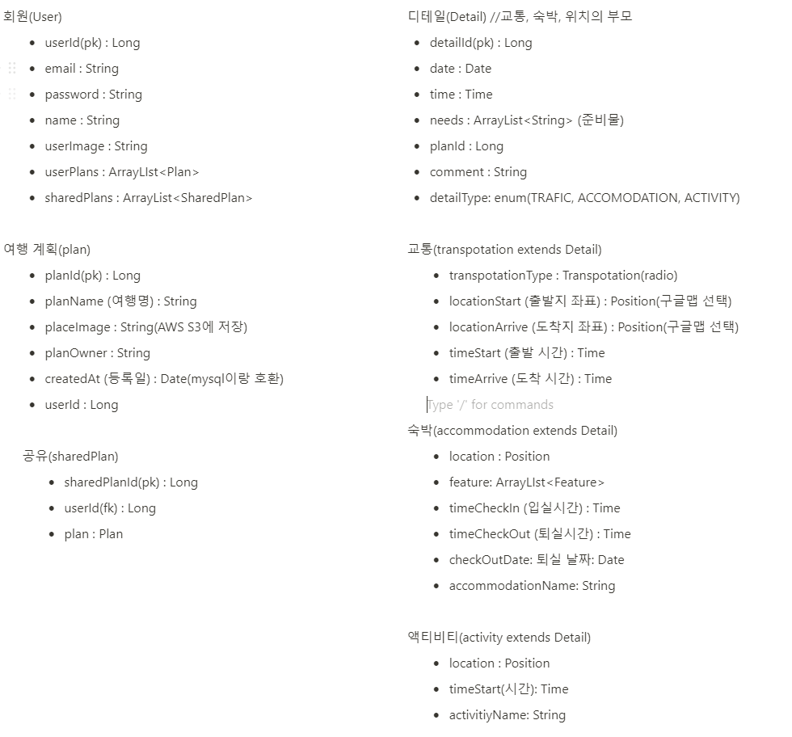
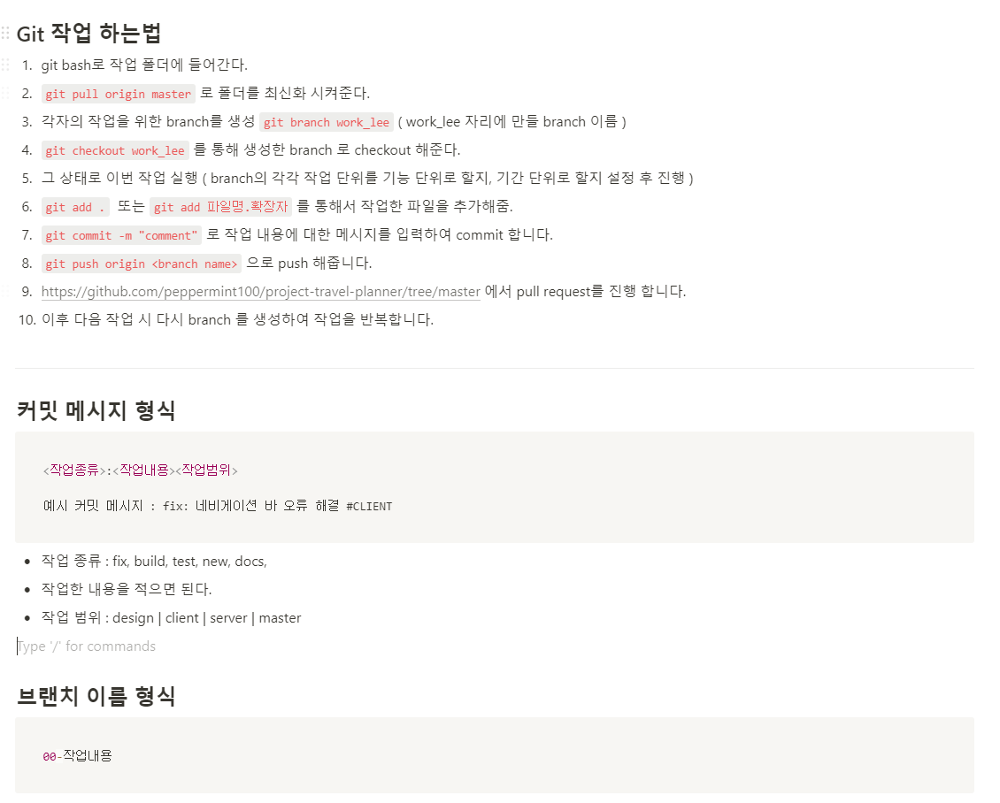
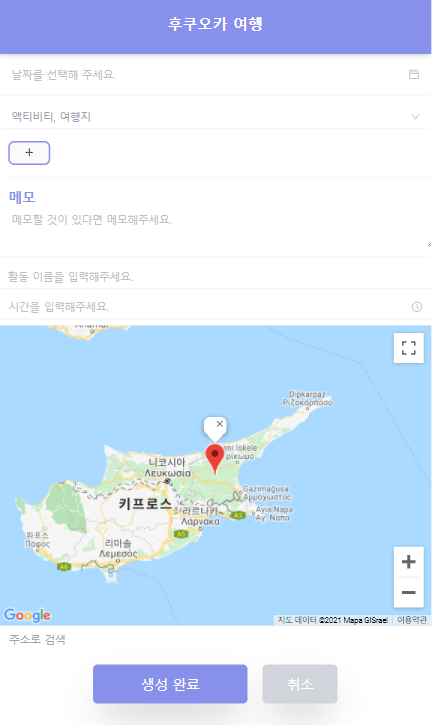

# 프로젝트 기획 및 프론트엔드 담당의 분담 역할, 개발 과정 및 후기

## 목차

1. [프로젝트 아이디어 제시 및 프로젝트 매니징](#프로젝트-아이디어-제시-및-프로젝트-매니징)
2. [db 스키마 작성](#db-스키마-작성)
3. [API 문서화](#API-문서화)
4. [깃허브 협업](#깃허브-협업)
5. [프론트 엔드 개발](#프론트-엔드-개발)
6. [결론](#결론)
---

## 프로젝트 아이디어 제시 및 프로젝트 매니징

프로젝트 자체의 아이디어를 제시하고 주요 기능을 설계하였다. 코로나 이전 해외여행이 맛들려서 방학 마다 가곤했는데, 매번 여행 계획을 친구가 만든 엑셀파일로 적어놓았다. 어느정도 필요한 만큼은 상세할 필요가 있어서 여행 계획 어플리케이션을 찾아보았는데, 다른 어플리케이션들은 굉장히 복잡한 사용 방법을 가지고 있어서 꼭 필요한 기능만 있으면 좋겠다고 생각하여 프로젝트를 기획하였다.

---

## db 스키마 작성

주요 기능을 정하고 DB 스키마를 노션에 러프하게 작성하였다. 



대학에서 컴퓨터공학을 부전공하며 데이터베이스 수업을 들었고 Typescript와 TypeORM을 사용해본 경험을 토대로 백엔드 개발 팀원과 협업하여 DB 스키마를 직접 작성하였다.

JPA를 사용해본적은 없었지만 다른 ORM을 사용해보았으므로 Class를 확장하여 동일 속성을 가진 다른 데이터를 저장하는 아이디어를 제시하였다(Detail => Transportation, Accomodation, Activity)

---
## API 문서화
API를 문서화 하였다. 프로젝트를 진행하며 가장 잘 기획했고 매끄러웠다고 생각한 부분이다. 프론트엔드와 백엔드의 통신이 중요한데, 이 때 API가 제대로 문서화 되어있지 않으면 프로젝트 진행이 어렵다. API 문서화를 어떻게 할지 구조를 약속하고 이 후 모든 API 문서를 백엔드 개발팀원이 작성하였다. 

작성 내용은 깃 루트 폴더의 노션 링크에서 확인할 수 있다. 그리고 이 API 문서화의 중요성을 깨닫고 공부를 조금 더 해본 결과 `Swagger`라는 라이브러리를 알게 되었고 바로 사용법을 공부하고 다른 프로젝트에 적용하였다. 적용한 내용은 [여기](https://velog.io/@peppermint100/Spring-Boot%EC%97%90-Swagger-%EC%A0%81%EC%9A%A9%ED%95%98%EA%B8%B0)에서 확인할 수 있다.


---
## 깃허브 협업
혼자서 깃허브를 코드 저장용으로 자주 사용해왔지만 다른 사람과 협업한 경험은 없어서 처음으로 branch와 merge를 배워서 해보았다. 실제로 프로젝트 깃을 생성하기전 테스트로 만들어서 백엔드 개발 팀원과 테스트를 한 후 실제 프로젝트 깃을 생성하고 진행하였다.

위에서 API 문서화에서는 팀원과 API 문서의 구조를 약속하고 진행하여서 매끄러웠는데, 한 번도 경험해보진 못했지만 깃허브의 커밋 메시지도 중요하다고 판단하여 팀원들과 깃허브 푸시 메시지의 양식을 정해 보았고 양식은 아래와 같다. ~~나름대로 약속을 하고 진행하여 배운 것은 많지만 딱히 활용한 기억은 없다.~~



*모든 협업 내용은 루트 폴더의 노션 링크에서 확인할 수 있다.*

---

## 프론트 엔드 개발
- 리액트의 기본적인 사용 방법은 알고 있기 때문에 기존에 알았던 부분이 아닌 새로 배운 부분에 대해서만 기록하였다.


- 처음으로 `TailwindCSS`를 적용해보았는데, 굉장히 빠르게 스타일을 입힐 수 있었다. 하지만 컴파일링 과정을 거치지 때문에 프로젝트를 처음 시작할 때 속도가 많이 느려지고 깃허브에서 주 프로젝트 언어가 CSS가 되는 일이 생겼다.이러한 부분은 컴파일된 CSS 파일을 gitignore에 등록하면 해결 가능하다. 어차피 재 시작시 `postcss`가 다시 `tailwind` 코드들을 재 컴파일을 하기 때문이다.

- 
### Debouncing을 통한 최적화
여행 제목을 적는 란의 value 값이 상태로 들어있으므로 값을 적을 때마다 계속해서 컴포넌트가 재 렌더링 되는 문제를 확인하였다. 이 경우에는 debouncing 기법을 통하여 최적화가 가능한데, 직접 구현할 수도 있지만 `lodash`라는 이미 구현된 라이브러리가 있으므로 사용하였다. 직접 구현하는 법은 블로그에 글을 적어놓았는데 [여기](https://krpeppermint100.medium.com/js-%EB%94%94%EB%B0%94%EC%9A%B4%EC%8A%A4%EC%99%80-%EC%93%B0%EB%A1%9C%ED%8B%80-2b83314ed7c6)에서 확인할 수 있다.

```typescript
const onChangeText = useCallback(
  _.debounce((text: string) => {
      console.log(text);
      dispatch(_setActivityName(text));
  }, 1000),
[]);

```

### memoization을 통한 최적화
리액트로 토이 프로젝트를 많이 진행해 보았지만, 최적화는 해본적이 없었다. 하지만 자연스럽게 복잡한 컴포넌트의 구조를 갖는 리액트 코드를 작성하니 최적화가 필요한 부분이 눈에 들어왔고 필요한 부분에서 최적화를 진행해보았다.

계획을 등록하는 폼에서 컴포넌트의 계층 구조는 아래와 같다.

```
commondetailform => activityform => map
```


여행 계획 폼내의 다른 input 값들이 Redux 스토어에 등록이 되어 있어서 여행의 날짜를 선택할 때, 그리고 여행의 메모를 적을 때에도 한 글자를 적고 지울때마다 계속해서 Map 컴포넌트가 재 렌더링 되는 문제가 생겼었다.

특히 구글 맵 API는 요청에 제한이 있고 그 이상을 넘어가면 과금이 되기도 하고 만약 실제로 서비스하는 제품이라서 비용에 대한 문제가 생긴다면 이러한 요청을 최소화 해주는것이 중요하다.

하나의 페이지가 여러 컴포넌트를 품고 있으므로 이러한 문제가 많이 생겼는데, 이러한 경우를 Memoization을 통해 해결하였다.

먼저 Map 컴포넌트에 React.memo를 씌워주었다.
```typescript
export default React.memo(MarkableMap);
```

이렇게 하면 MarkableMap은 자신이 받는 Props의 변경에만 재 렌더링을 한다. MarkableMap은 두 개의 props를 받는데, 바로 MapState와 setMapState이다. 각각 현재 마커 위치, 현재 마커위치 변경을 할 수 있는 props이다. 

하지만 이렇게만 하면 원하는대로 작동이 되지 않는다. 왜냐하면 부모 컴포넌트가 리 렌더링이 될 때마다 `setMapState`라는 함수도 재 선언이 되고 결국 이 `setMapState`의 변화가 Map 컴포넌트의 props이므로 맵이 계속해서 깜박거리는 현상이 지속되었다.

해결 방법은 `useCallback`을 이용한다.

```typescript
const setMapState = usecallback(
  (state: mapstatetype) => {
        dispatch(_setmapstate(state));
    }, []);
```

위와 같이 setMapState를 Memoization 해주면 setMapState라는 함수도 `useCallback`의 두 번째 인자인 `dependency`의 영향을 받아 변하지 않기 때문에 Map 컴포넌트의 `React.memo`가 의도한대로 사용되는 것을 확인할 수 있었다.

- type 모듈이 없는 라이브러리의 사용

```
declare module "react-google-autocomplete"
// decs.d.ts
```
---

## 결론
처음으로 팀으로서 웹 개발 프로젝트를 진행해보아서 미숙한 점이 굉장히 많았다. 결과적으로는 혼자 하는 것보다 결과도 안좋고 시간도 엄청나게 많이 걸렸다. 하지만 팀으로서의 웹 개발의 전반적인 프로세스를 이해하는데 큰 도움이 되었고, 부족했던 점이 어떤 부분이었는지 정확히 알 수 있었다. 

가장 큰 이유이자 모든 이유의 시작점이 되는 부분은 기획의 부족함이었다. 나름대로 이 정도 생각하고 들어가면 되겠지 라고 생각했지만 전혀 충분하지 않았다. 학교에서 자료구조를 강의하셨던 교수님이 소프트웨어 프로젝트는 80%가 기획이고 20%가 코딩이라고 한 사실이 떠올랐다.

기획을 제대로 하지 않음으로서 백엔드 개발에서 소통의 부재로 일치하지 않는 부분이 많이 생겼다. 일치하지 않는 부분을 고치기 위해 이 작업을 해달라고 요청하고 그 작업이 끝나면 프론트엔드의 다음 작업을 하는 듯 굉장히 절차지향적인 프로세스가 지속되었다.

그리고 디자인도 기획이 제대로 되지 않아 어떤 기능이 어디에서 들어가는지 확실하지 않았기 때문에 디자인 시안의 순서가 뒤죽박죽이었고 결국 프론트엔드 코드가 엄청나게 꼬이는 상황이 발생하였다. 전부 엎기에는 서로가 프로젝트 마감 기한을 2월 초로 약속을 해놓았기에 그대로 진행하였다.

하지만 굉장히 배운점이 많았다. 먼저 어떤 부분에서 Redux를 쓰면 좋은지 알게 되었다. 전혀 Redux가 필요없는 부분에서도 Redux를 쓰곤했는데, 프로젝트가 커져도 전혀 Redux 사용에 이점이 없는 부분들을 보며 배울 수 있었다.

또 NextJS의 폴더 구조를 참조하여 pages폴더와 component폴더는 나누어 pages에서만 최대한 API 콜을 하는 구조를 생각해낼 수 있었다. 뷰를 담당하는 부분은 뷰만 담당하도록 하고 API 콜은 최대한 상위 컴포넌트에서 진행하면 Memoization으로 최적화하기에 용이하다는 점을 배울 수 있었다.

또 API 문서화의 중요성도 알 수 있었다. 조금 무식하게 API를 문서화하긴 했지만 구조를 약속하고 백엔드 개발 팀원도 잘 적어준 덕분에 API 콜에 있어서는 철자 문제를 제외하면 매끄럽게 진행되었다.

최종적으로 결과물은 안좋았지만 그것에 대해서 전혀 후회가 없는 팀 프로젝트였다. 배운 점이 정말 많았고 이를 토대로 새로운 사이드 프로젝트를 진행해보았는데, 더 좋은 코드로 더 빠른 효율을 내서 완성할 수 있었다.
